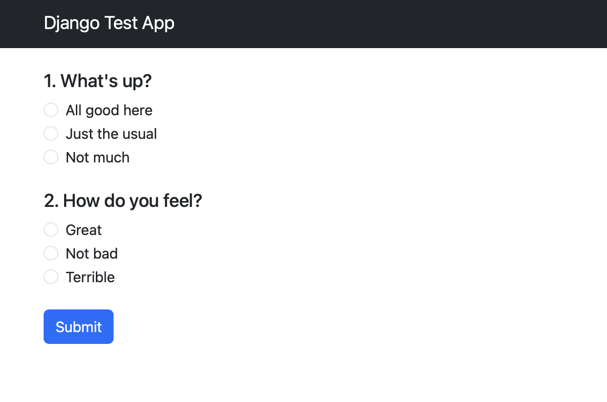

# Django Test App

A web application built with **Django** that allows you to create, manage, and take scoring-based tests. This app is ideal for psychological quizzes, educational assessments, or any scenario where multiple-choice questions are scored and a total result is calculated.

---

## Features

- **Create Tests:** Define multiple tests with titles and descriptions.  
- **Add Questions:** Each test can have multiple questions.  
- **Multiple Choices:** Questions can have several answer options, each with a numeric score.  
- **Compute Scores:** After completing a test, users receive a total score based on their selected choices.  
- **Bootstrap Frontend:** Responsive and modern interface using Bootstrap 5.  
- **Simple Extensible Architecture:** Easy to expand with new features like user accounts, analytics, or conditional question flows.

---

## Screenshots



---

## Installation

### Prerequisites

- Python 3.x  
- pip  
- Virtual environment (recommended)  

### Steps

1. Clone the repository:
```bash
git clone https://github.com/saniazzt/Django-Test-app.git
cd Django-Test-app
```

2. Create and activate a virtual environment:
```bash
python -m venv venv
# On Windows
venv\Scripts\activate
# On macOS/Linux
source venv/bin/activate
```

3. Install dependencies:
```bash
pip install Django
```
4. Apply migrations:
```bash
python manage.py makemigrations
python manage.py migrate
```

5. Create a superuser for admin access:
```bash
python manage.py createsuperuser
```

6. Run the development server:
```bash
python manage.py runserver
```
Open your browser at http://127.0.0.1:8000/ to view the app.
